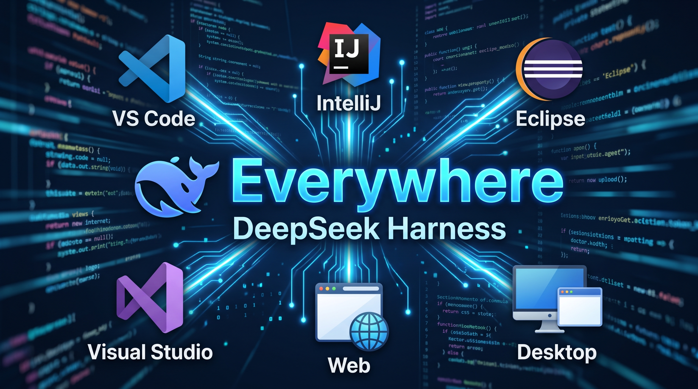

<div align="center">



# Everywhere: DeepSeek Harness for Visual Studio 2022

**Conectando o Visual Studio 2022 ao DeepSeek Harness**

[-purple?logo=visualstudio)](https://visualstudio.microsoft.com/)
[](https://dotnet.microsoft.com/)
[](https://developer.microsoft.com/en-us/microsoft-edge/webview2/)
[](https://deepseek.com)

</div>

Esta é a extensão oficial do **Everywhere** desenvolvida especificamente para o **Microsoft Visual Studio 2022** (IDE clássica, arquitetura x64).

Ela incorpora o runtime oficial do **DeepSeek Harness (`dsh`)** em uma janela de ferramentas nativa (**Tool Window**) utilizando **Microsoft Edge WebView2 + WPF**, oferecendo uma interface ágil e integrada diretamente ao seu fluxo de trabalho de soluções e projetos C#, C++, .NET e Web no Visual Studio.

---

## 🌟 Funcionalidades

- 🪟 **Tool Window Nativa com WebView2**: Interface responsiva e fluida com aceleração por hardware para renderização do DeepSeek Harness.
- 📂 **Workspace Solution Binding**: Inicia automaticamente vinculado à pasta da Solution aberta no Visual Studio (`DTE.Solution.FullName`).
- 🔄 **Auto-Recuperação Inteligente (Exit Code 1)**: Se houver processos antigos ou portas presas (3080/3000), o gerenciador detecta a saída com código 1, encerra serviços órfãos automaticamente e reinicia a conexão em segundos.
- ⚙️ **Página de Opções Integrada**: Configurações diretamente em `Tools -> Options -> Everywhere` (chaves de API, portas, perfis, auto-start).
- 🧭 **Barra de Ações Rápida**: Botões de início (▶), parada (🛑), reinicialização (🔄), recarregamento da página (🔁) e atalho para configurações.
- 📋 **Canal de Saída Dedicado**: Logs em tempo real na janela **Output** do Visual Studio (selecionando *Everywhere (DeepSeek Harness)*).

---

## 🚀 Como Compilar e Executar

### Pré-requisitos
1. **Visual Studio 2022** (Community, Professional ou Enterprise) com a carga de trabalho:
   - **Desenvolvimento de extensão do Visual Studio** (Visual Studio extension development).
2. **DeepSeek Harness CLI**:
   ```cmd
   npm install -g @deepseek-ai/dsh
   ```

### Passos de Compilação
1. Abra a solution `visualstudio/Everywhere.sln` no Visual Studio 2022.
2. Restaure os pacotes NuGet (o Visual Studio faz isso automaticamente na compilação).
3. Selecione a configuração `Debug` ou `Release` e a plataforma `Any CPU` ou `x64`.
4. Pressione **F5** para iniciar a Instância Experimental do Visual Studio (**Exp**).
5. Na instância experimental, vá em:
   `View` ➔ `Other Windows` ➔ `Everywhere (DeepSeek Harness)`.

### Gerando o arquivo `.vsix` para Instalação Direta
- Compile em modo `Release`: o instalador `Everywhere.vsix` será gerado em:
  `visualstudio/Everywhere/bin/Release/Everywhere.vsix`.
- Para instalar na sua máquina, dê dois cliques no arquivo `.vsix` gerado.

---

## ⚙️ Configurações (Tools ➔ Options)

| Opção | Padrão | Descrição |
|---|---|---|
| **Auto Start** | `true` | Iniciar o agente automaticamente ao abrir a Tool Window |
| **Port** | `0` | Porta do servidor web (0 atribui porta livre automaticamente) |
| **Profile** | `"web"` | Perfil de execução do DeepSeek Harness |
| **API Key** | `""` | Chave da API DeepSeek (também aceita via `DEEPSEEK_API_KEY`) |
| **Base URL** | `https://api.deepseek.com` | Endpoint base da API DeepSeek |
| **Custom DSH Path** | `""` | Caminho personalizado para o binário `dsh` se não estiver no PATH padrão |
